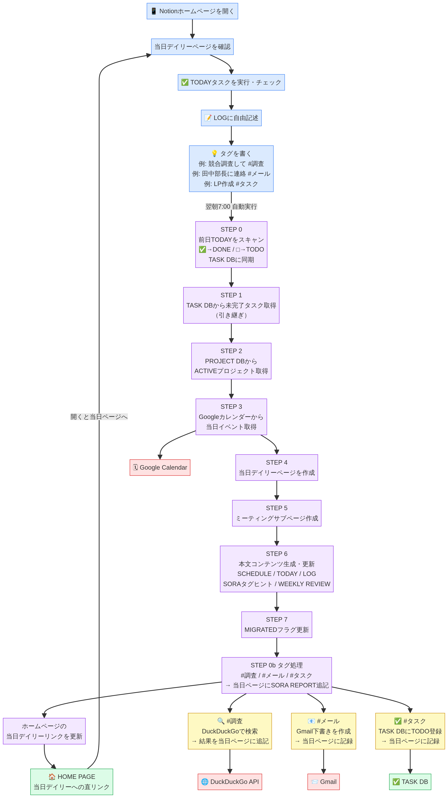

# LIFE OS v01 自動化フロー

LIFE OS v01 は、毎朝7:00（JST）の1回の実行ですべての処理を完結させます。夜間スキャンは廃止し、前日の振り返りと当日の準備を朝の処理に統合することで、クレジット消費を最小限に抑えています。

---

## フロー図



---

## 朝7:00 統合フロー（唯一の自動実行）

```
[朝7:00 起動]
      |
      v
STEP 0: 前日のデイリーノートをスキャン → TASK DB同期
  ─ 前日の DAILY DB ページを検索
  ─ TODAYセクションのチェックボックスをパース
  ─ チェック済み [x] → TASK DB に STATUS=DONE で登録
  ─ 未チェック  [ ] → TASK DB に STATUS=TODO, MIGRATED=false で登録
  ─ ※前日のデイリーが存在しない場合はスキップ
      |
      v
STEP 0b: 前日デイリーのタグを自動実行（tag_processor）
  ─ 前日ページ全体のテキストをスキャン
  ─ 「<指示> #タグ」パターンを検出（TODAY・LOG等すべてのセクション対象）
  ─ #調査 → DuckDuckGoでWeb調査して結果を当日ページに追記
  ─ #メール → Gmail下書きを作成（即送信なし）して当日ページに記録
  ─ #タスク → TASK DBに自動登録して当日ページに記録
  ─ ※タグがない場合はスキップ（クレジット節約）
      |
      v
STEP 1: TASK DB から未完了タスクを取得
  ─ STATUS=TODO かつ MIGRATED=false のタスクを全取得
  ─ これが当日デイリーの「🔁 引き継ぎタスク」になる
      |
      v
STEP 2: PROJECT DB からACTIVEプロジェクトを取得
  ─ STATUS=ACTIVE のプロジェクト一覧を取得
  ─ 各プロジェクトに紐付く TODO タスクを取得
  ─ 進捗（PROGRESS）と NEXT_ACTION を取得
      |
      v
STEP 3: Google Calendar から当日イベントを取得
  ─ primary カレンダーの当日00:00〜23:59のイベントを取得
  ─ 時刻順にソート
  ─ ミーティング系キーワード（MTG/会議/打ち合わせ等）を判定
      |
      v
STEP 4: DAILY DB に当日ページを仮作成（ページIDを取得）
  ─ タイトル: YYYY-MM-DD（曜日）
  ─ TYPE: Daily（金曜は Weekly Review）
      |
      v
STEP 5: ミーティングサブページを作成（イベントがある場合のみ）
  ─ ミーティング系イベントごとに DAILY ページ配下にサブページを作成
  ─ サブページ構成: 日時・参加者・アジェンダ・AI Meeting Note欄・決定事項・Next Action
  ─ ※ミーティングがない日はスキップ（クレジット節約）
      |
      v
STEP 6: 本文コンテンツを生成してページを更新
  ─ SCHEDULEセクション: イベント一覧（ミーティングはサブページリンク付き）
  ─ TODAYセクション: 引き継ぎタスク(🔁) + PJタスク + 手動追加欄
  ─ PROJECT STATUSセクション: 進捗% + 次アクション
  ─ LOGセクション: 自由記述欄（空欄）
  ─ SORAタグヒント: #調査/#メール/#タスクの使い方をページに表示
  ─ WEEKLY REVIEWセクション: 金曜日のみ追加
      |
      v
STEP 7: 引き継ぎタスクの MIGRATED フラグを true に更新
  ─ 多重引き継ぎを防ぐためのフラグ管理
      |
      v
STEP 0b実行: タグ処理結果を当日ページの末尾に追記
  ─ ## 🤖 SORA REPORT セクションに出力
      |
      v
STEP 8: 🏠 TODAY HOMEページの当日デイリーリンクを更新
  ─ ホームページを開くと常に当日のデイリーへのリンクが表示される
      |
      v
[完了: 今日のデイリーノートが完成]
```

---

## TAKUMIの1日の動線

| タイミング | アクション |
|---|---|
| 朝7:00 | SORAが自動実行（前日スキャン＋タグ処理＋当日デイリー生成＋ホームページ更新） |
| 朝（確認） | **🏠 TODAY HOME** を開く → 当日デイリーへの直リンクが表示されている |
| 日中 | TODAYのタスクにチェック、LOGに何でも書く |
| 随時 | TODAYに直接タスクを追記（翌朝自動でTASK DBに登録される） |
| 随時 | タグを書く（翌朝7:00に自動実行）: |
| | `調べたいこと #調査` → Web調査して翌日デイリーのSORA REPORTに結果を追記 |
| | `メール内容 #メール` → Gmail下書きを自動作成（宛先は手動で設定） |
| | `タスク名 #タスク` → TASK DBにTODOで自動登録 |
| 金曜 | WEEKLY REVIEWセクションに振り返りを書く |
| PJ更新 | PROJECT DBのNEXT_ACTION・PROGRESSを手動更新 |

---

## SORAタグの使い方

デイリーページの **どこにでも**（TODAY・LOG・どのセクションでも）以下の形式で書くだけです。

| タグ | 書き方の例 | 翌朝7:00に実行されること |
|---|---|---|
| `#調査` | `競合A社の最新AI動向を調べて #調査` | DuckDuckGoでWeb調査 → 結果を翌日デイリーのSORA REPORTに追記 |
| `#メール` | `田中部長に打ち合わせ日程調整メール #メール` | Gmail下書きを作成（即送信なし）→ 翌日デイリーに記録 |
| `#タスク` | `ランディングページのワイヤーフレームを作る #タスク` | TASK DBに STATUS=TODO で自動登録 → 翌日デイリーに記録 |

**書き方のルール:**
- `<指示内容> #タグ名` の順番で書く（タグは末尾）
- チェックボックス記法（`- [ ]`）の中でも使える
- 1行に1タグ（複数タグは別行に）
- 結果は翌日デイリーの `## 🤖 SORA REPORT` セクションに出力される

---

## Notionページ構成

| ページ | URL | 役割 |
|---|---|---|
| 🏠 TODAY HOME | [開く](https://www.notion.so/370200b3cc7081a6ba0debd25cdf34d2) | 当日デイリーへの直リンク（毎朝自動更新） |
| 🧠 LIFE OS TOP | [開く](https://www.notion.so/370200b3cc708115a943d66ec4ed1206) | ワークスペースのトップ |
| 📅 DAILY DB | [開く](https://www.notion.so/77de58c499d14be9817ebd539c551eb0) | デイリーノート一覧 |
| ✅ TASK DB | [開く](https://www.notion.so/6135d9e113d64fba81c4d12d3ac24bfe) | タスク管理 |
| 🚀 PROJECT DB | [開く](https://www.notion.so/ae6d2424256c47249c5cdccf644560bc) | プロジェクト管理 |
